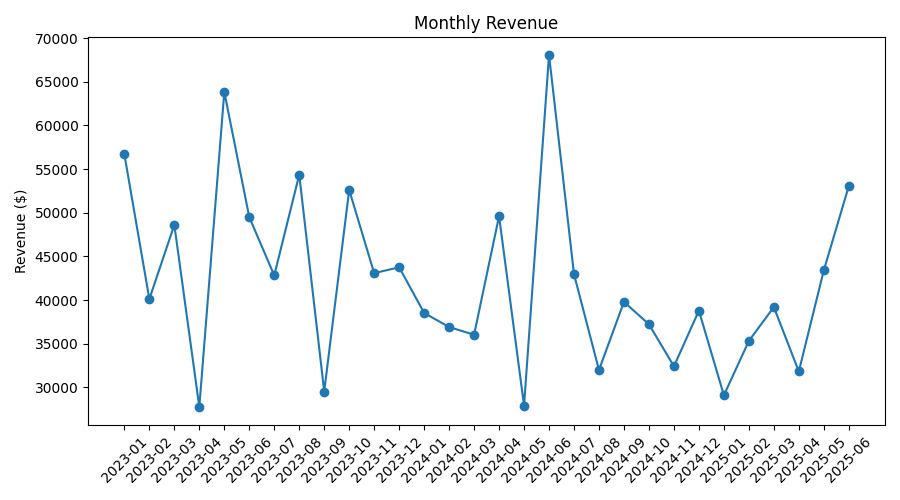
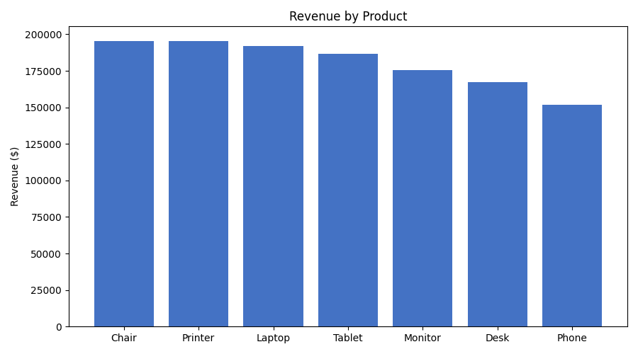
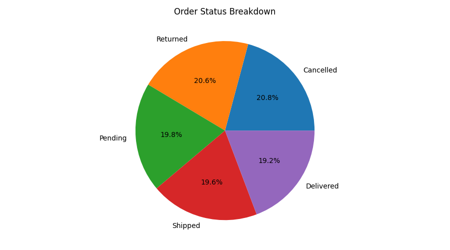
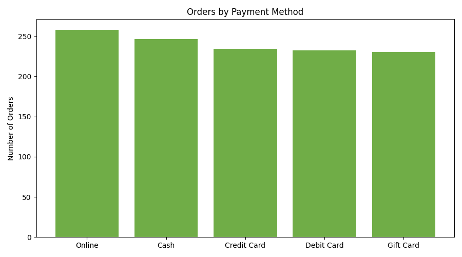
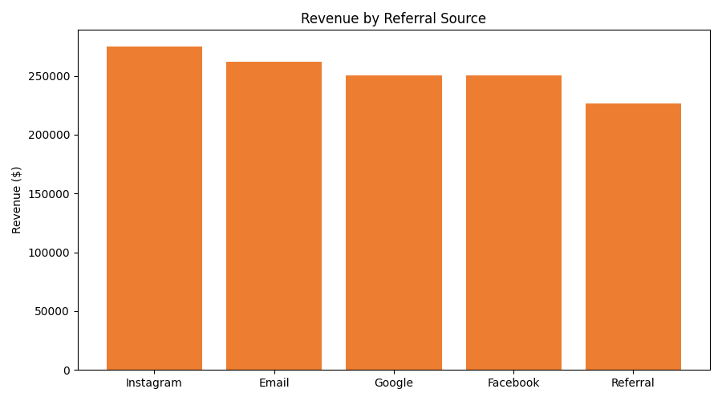
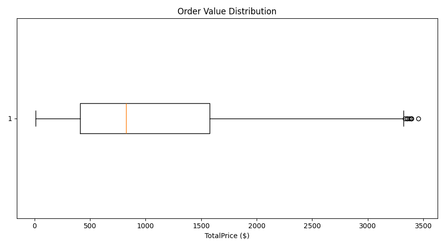

# Project 2: Exploratory Data Analysis (EDA) 📊

## Overview
This project analyzes the cleaned **Online Store Orders** dataset (1,200 orders, from Project 1) to understand sales patterns, trends, and distributions in the business.

## Goal
Analyze the dataset to understand patterns, trends, and distributions using descriptive statistics and visualizations.

## Dataset
`Online-Store-Orders-Cleaned.xlsx` — output of Project 1 (1,200 rows, 14 columns).

## Tools Used
- Python 3
- pandas
- matplotlib

## Basic Statistics

| Metric | Quantity | Unit Price ($) | Total Price ($) | Items In Cart |
|---|---|---|---|---|
| Mean | 2.95 | 356.41 | 1,053.97 | 5.48 |
| Median | 3.00 | 364.21 | 823.62 | 5.00 |
| Count | 1,200 | 1,200 | 1,200 | 1,200 |

The gap between the mean ($1,053.97) and median ($823.62) order value shows the revenue distribution is right-skewed — a smaller number of high-value orders are pulling the average up.

## Trends

### Monthly Revenue


Revenue fluctuates month to month with no strong seasonal pattern, ranging roughly between $28K and $68K per month across the 2.5-year period (Jan 2023–Jun 2025).

### Revenue by Product


Chairs ($195,620) and Printers ($195,613) are the top revenue generators, while Phones ($151,722) bring in the least — but all seven products perform within a fairly tight range, so no single product dominates sales.

### Order Status Breakdown


Orders are almost evenly split across all five statuses (Cancelled, Returned, Pending, Shipped, Delivered — each 19–21%). Notably, only 19.3% of orders are marked **Delivered**, while **Cancelled** (20.8%) and **Returned** (20.6%) combined make up over 41% of all orders.

### Payment Method


### Revenue by Referral Source


Instagram ($275,285) drives the most revenue, followed by Email ($261,809). Direct Referrals bring in the least ($226,816).

### Coupon Impact
Average order value stays roughly consistent regardless of coupon used (between $1,036 and $1,070), suggesting coupons aren't strongly influencing how much customers spend per order.

## Outlier Detection
Using the IQR method on order value (TotalPrice):
- Normal range: **$0 – $3,330**
- **8 orders** fall outside this range as high-value outliers



## Key Observations
- Revenue is right-skewed — a handful of large orders pull the average above the median.
- Only ~19% of orders are successfully delivered; cancellations and returns together account for over 40% of all orders, which may be worth investigating operationally.
- Product sales are fairly balanced, with Chairs and Printers slightly ahead.
- Instagram is the strongest referral channel by revenue.
- Coupons don't appear to meaningfully change average order value.
- 8 orders are statistical outliers on the high end and may warrant manual review.

## Files in this Repository
- `Online-Store-Orders-Cleaned.xlsx` — input dataset (from Project 1)
- `eda_analysis.py` — Python script that generates all stats and charts
- `chart_*.png` — generated chart images
- `README.md` — this report

## How to Run
```bash
pip install pandas matplotlib openpyxl
python eda_analysis.py
```

## Author
Deepanshu — Data Analytics Intern Project 2
